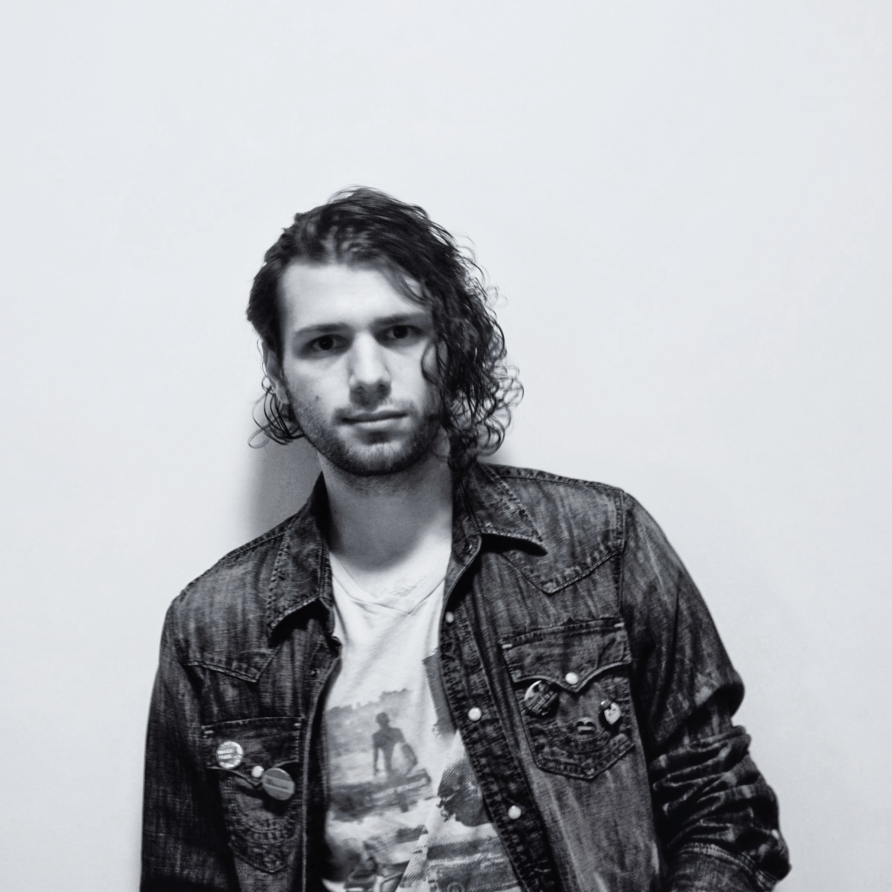

# About me

Nicolás Escarpentier is a non-binary *immersive media artist/technologist* from Santiago, Chile. Specialized in VR/AR and large-scale interactive installations, they focus on identifying opportunities across emerging technologies to project-specific solutions. Their projects aim to augment and create non-conventional forms of expression with far-reaching impact, pushing the state of the art on experiential storytelling. 
<!-- Nicolás has excellent project managment and team leadership skills and extensive client-facing experience -->

<figure class="profile">
    
</figure>

Nicolás has a M.P.S. degree from NYU’s [Interactive Telecommunications Program](https://tisch.nyu.edu/itp), and is part of the [Positive Null collective] and the [activist co-op, Unglitch](http://unglitchthe.net/).

 

[Download my CV here](https://drive.google.com/file/d/1slFtjswGtGnyAEmall3oDxSJ4afbUsaZ/view?usp=sharing)

## exhibitions

- **[Ace Hotel](https://www.acehotel.com/newyork/)**, 2019 - Live visual show, with [Collabarét](https://www.collabaretnyc.com/)
- **[Made in NY Media Center](https://nymediacenter.com/)**, 2019 - Curation & [project](http://nicolaspe.com/portfolio/collected_ego) showcase
- **Warehouse 623**, 2019 - Curation & [installation](http://nicolaspe.com/portfolio/inner_cadence) showcase
- **[Pioneer Works](https://pioneerworks.org/)**, 2018 - Installation showcase
- **[IAC Building](https://www.iac.com/)** 2018 - [Audiovisual short](http://nicolaspe.com/portfolio/collected_ego) showcase
- **[ISSUE Project Room](https://issueprojectroom.org/)**, 2018 - [Performance showcase](http://nicolaspe.com/portfolio/competing_voices)
- **[NYC Media Lab](https://nycmedialab.org/)**, 2018 - Installation showcase
- **[World Maker Faire NY](https://makerfaire.com/new-york/)**, 2018 - [Project](http://nicolaspe.com/portfolio/rythmic_skin) showcase

## find me here

    
    
    

