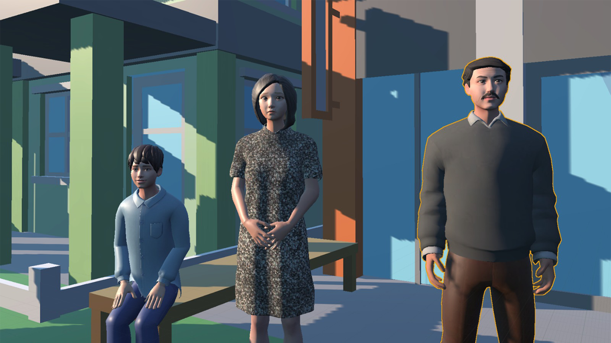
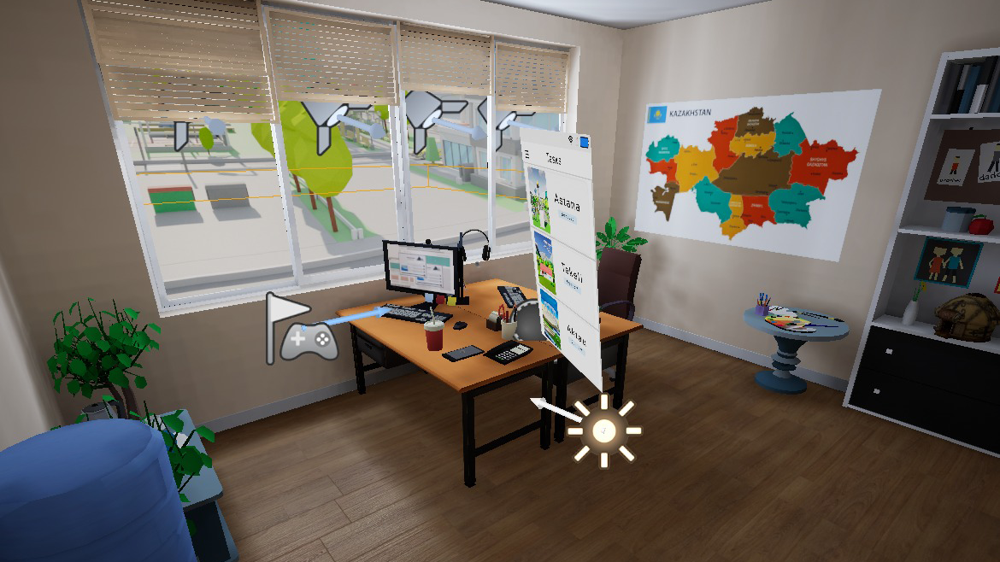
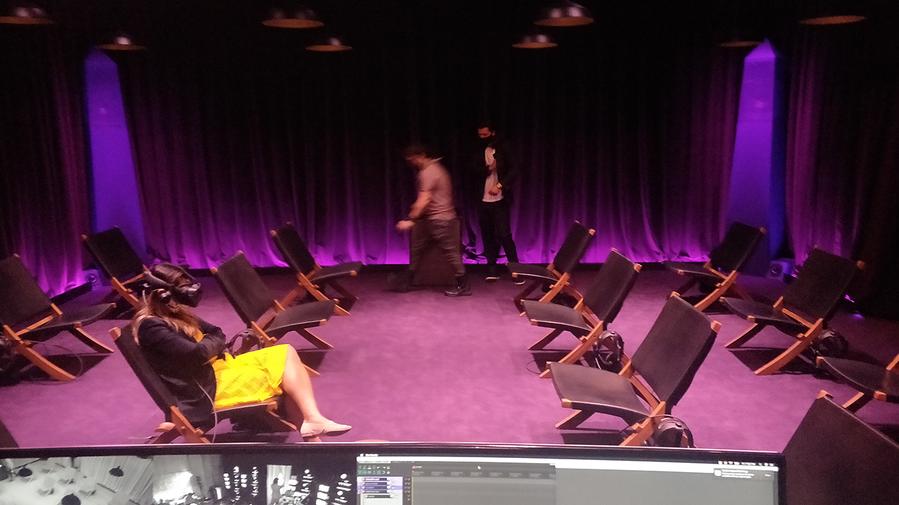
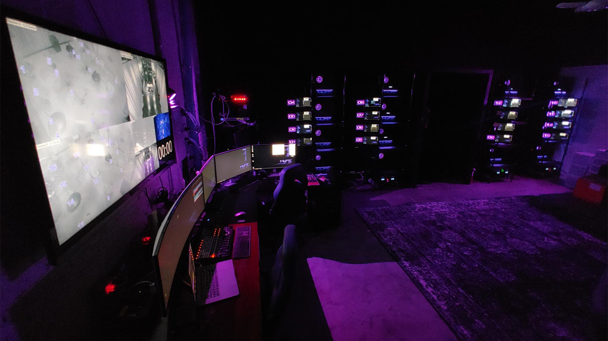
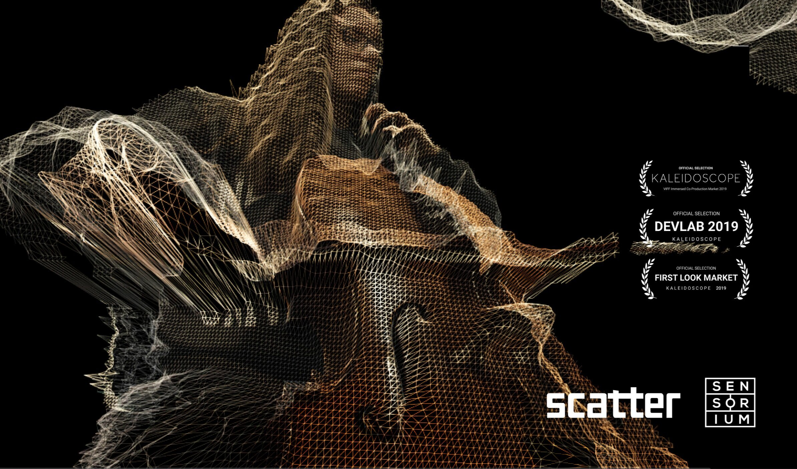
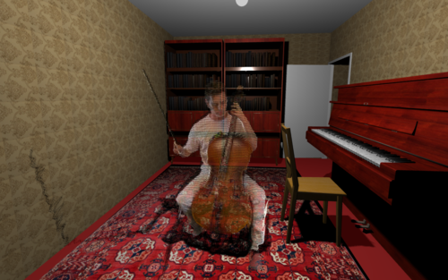
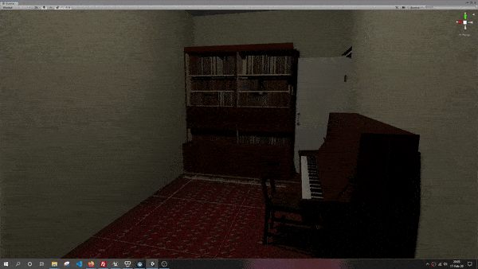

# External work
I have provided a diverse set of services to a wide variety of clients, ranging from full production and management to technical consultancies.

## *Ana Min Wein? (Where am I from?)* 
*for [Nouf Aljowaysir](http://www.noufaljowaysir.com/)*

**Role: Producer and Creative Support**

Producer and creative production support for Nouf Aljowaysir’s short documentary AI film, [*Ana Min Wein?*](https://channel.somersethouse.org.uk/artworks/all/ana-min-wein-where-am-i-from), as part of the PATH AI commissions from Somerset House. 

For this project, I worked closely alongside the director to manage and plan the timeline and budget for this 5-month residency. This scope was adjusted by taking particular considerations of her specific strengths, expertise areas, and new challenges, as well as the project's overall necessities and estimated hurdles. I was also in charge of the coordination of the project, which included reaching out for and hiring an animator to cover unmet needs, and holding recurring check-in meetings to keep track of the progress and provide timely feedback.

<figure class="vid_container vid_720_full" style="text-align: center; display: block;">
	<video class="vid_doc" autoplay loop>
        <source src="./media/ext_AMW_prev.mp4" t ype="video/mp4">
        <source src="./media/ext_AMW_prev.webm" type="video/webm">
    </video>
	<figcaption>Small preview from the film</figcaption>
</figure>

During production, I performed additional creative assistance with tasks such as film editing, sound design, and camerography, in order to ensure the director's desired impact and message. Finally, I have been assisting in coordinating and planning the distribution strategy of the film for international films and showcases, including the physical [World Premiere in London, UK at Somerset House](https://www.somersethouse.org.uk/whats-on/click-and-collect-show-me-your-dataset), [a showcase in Paris, France by Kadist at Centre Pompidou](https://kadist.org/program/the-future-is-not-what-it-used-to-be/), amonst others.

## *Digital Family Card* 
*for UN DP Kazakhstan*

**Role: Senior VR & technical consultant**

Assisting as a VR & technical consultant for the *“Digital Family Card”* VR experience in collaboration with United Nations Development Programme Kazakhstan. 

Provided thorough feedback to the Kazakhstan-based VR development team on diverse levels of technical matters: Unreal Engine based optimization and improvements, Oculus Quest specific constraints and workflows, and overall upgrades specific to VR user experience. Additionally, provided support for the installation and presentation of the piece, showcased at the [UN High-Level Political Forum on Sustainable Development at the United Nations Headquarters in NYC, 2023](https://hlpf.un.org/2023).

<figure class="proj_img proj_img_full" style="text-align: center; display: block;">
	 
	
	<figcaption>Digital Family Card VR experience</figcaption>
</figure>

[Watch the coverage of this project from a news station from Kazakhstan here](https://www.youtube.com/watch?v=llpwazXYf9o)

## *Central Launcher Software* 
*for the Museum of Future Experiences (MoFE)*

**Role: Developer**

Developed a pair of network control and client softwares to manage the showcase pipeline of the venue for a seamless and synchronized experience to the audience.

The launcher software connects via UDP protocol to each of the 16 PCs for each seat, as well as the audio Mac device, and send specific messages to play (or stop) a selected piece. The client software receives the message and triggers the appropriate actions, and is configurable with a text-based ini file for ease of use and replicability. 

This dual software was robust enough to work without issues over several shows per week. Finally, I provided upgrades and extra functions depending on the new needs of the upcoming shows, including modifications to Unreal Engine projects that required a more intricate connection.

<figure class="proj_img proj_img_full" style="text-align: center; display: block;">
	 
	
	<figcaption>Museum of Future Experiences venue</figcaption>
</figure>

## *1991* 
*for [Akmyrat Tuyliyev](https://www.akmyrat.com/)*

**Role: Lead VR Developer**

A VR documentary about the Post-Soviet trauma and healing, where participants will witness memories, unveiling the complexities of daily life during the transitional times after the collapse of the USSR.
Selected for IDFA Forum 2021.

<figure class="proj_img proj_img_full" style="text-align: center; display: block;">
	 
	
</figure>

 
<figure class="proj_img proj_img_center" style="text-align: center">
	
	<figcaption>Demo scene of 1991</figcaption>
</figure>

<!-- ## *Stay Alive My Son* 
*for Bousis Film Company*

**Role: VR Developer & Creative Assistance**

The prototype for an unreleased festival-bound virtual reality experience, that takes the audience through a story of loss, love and hope: a journey through the heart of a genocide survivor. -->

<a href="#" onClick="history.go(-1);return true;">\< Go Back</a>
