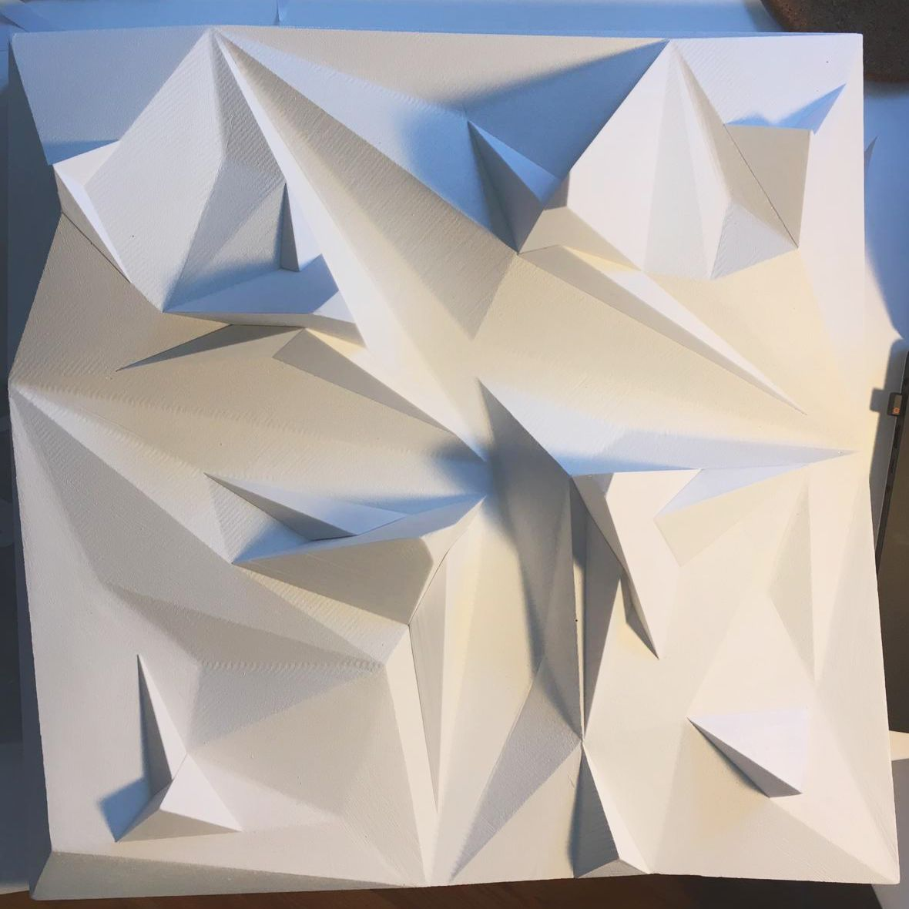
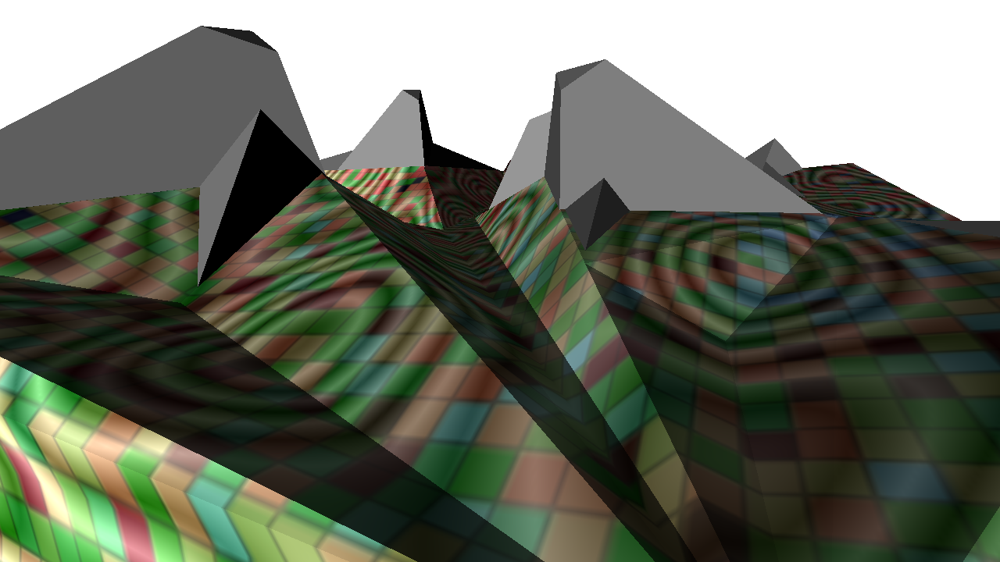
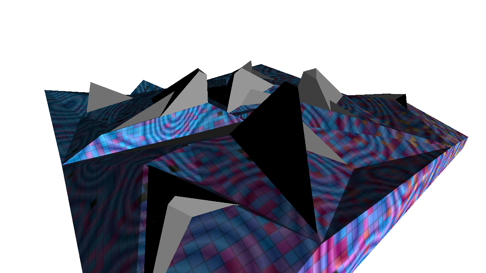
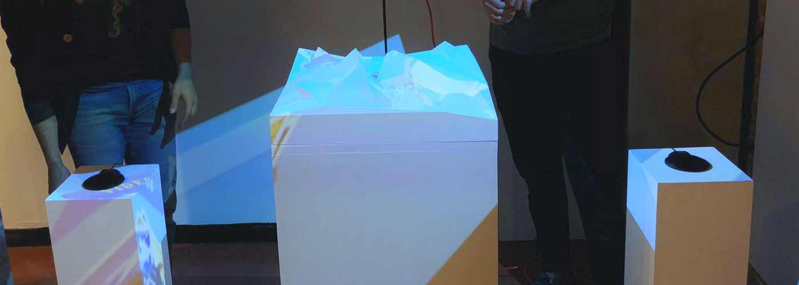

<!--
title: "Automorphic"
date:  "2019-09-19"
display: true
weight: 1
-->

# Automorphic

Automorphic is a 3D printed sclupture that serves as a canvas for multiple projectors that help create the illusion of an ever-changing volume that responds to its immediate surroundings.

 

<figure class="proj_img proj_img_sideL" style="text-align: center">
    
</figure>

Following the principles of responsive architecture, Automorphic is an architectural object that can modify its presence in response to its immediate environment. The aesthetic of this “smart” object is defined on its own, based on the data collected from its surroundings. Instead of following the direct and deliberate process of its creator, the audience around becomes the designer by inadvertently modifying this temporary three-dimensional aesthetic.

<figure class="proj_img proj_img_center" style="text-align: center; display: block;">
	 
	
</figure>

Automorphic is a 3D printed object that serves as a canvas for multiple projectors that help create the illusion of an ever-changing volume and houses a variety of sensors. While sound data is processed by openFrameworks, computer vision is used to analyze camera input for tracking activity in the surrounding. These environmental inputs alter the size, material, and arrangement of the ever-changing form of projected imagery.

By virtually enhancing Automorphic, aesthetic is always ephemeral as it responds constantly to environmental changes and unsteady human actions.

<figure class="proj_img proj_img_full" style="text-align: center">
    
</figure>

 <a href="#" onClick="history.go(-1);return true;">\< Go Back</a>
