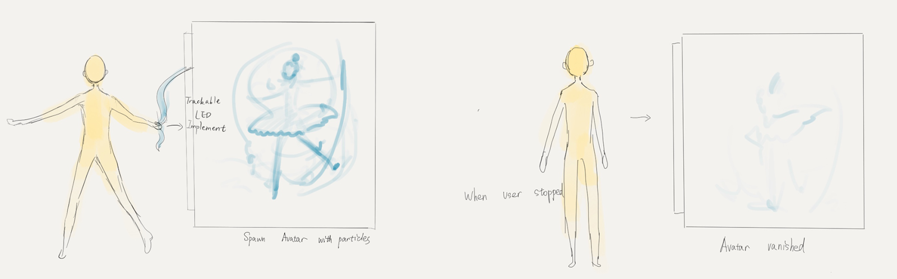
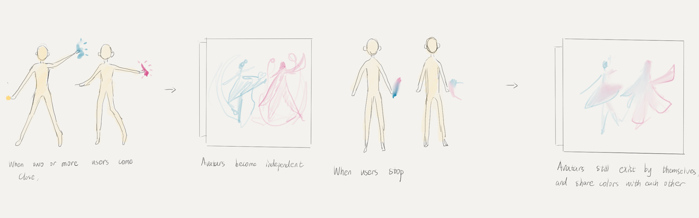

<!--
title: "Coalition"
date:  "2018-12-15"
display: true
image: "img/portfolio/coalition.png"
weight: 1
-->

# Coalition

A motion-based interactive experience about diversity in an oppressive society. <!--more-->
Made in collaboration with [Ridwan Madon](https://www.ridwanmadon.com/), [Xiaowei Lu](https://wp.nyu.edu/llllllxw/author/xl2334/) and [Yibing Qian](http://yibingqian.org/).

<figure class="vid_container vid_16x9 vid_ext" style="text-align: center">
  <iframe src="https://www.youtube.com/embed/mPhG_J-Jd5M" frameborder="0" allow="accelerometer; encrypted-media; gyroscope" allowfullscreen></iframe>
</figure>

Coalition is an exploration of motion as expression of individuality and the struggle against oppressive societies. It is an immersive live experience that represent the union of motion and sound conveying individuality and uniqueness against the status quo of society

<figure class="proj_img proj_img_center" style="text-align: center">
  
   
  
	<figcaption>User experience diagrams</figcaption>
</figure>

We see motion as a form of expression, which conveys individuality and emotions. When placed in the context of its environment, this uniqueness and diversity will often be met with resistance, as society as a whole prefers to maintain the status-quo.

This oppression has long lasting direct and side effects on communities, and is ever present in our times. As individuals, we are powerless against society. As we unite, we aim for the common good.

<figure class="vid_container vid_16x9 vid_ext" style="text-align: center">
  <iframe src="https://player.vimeo.com/video/327081816"  frameborder="0" webkitallowfullscreen mozallowfullscreen allowfullscreen></iframe>
</figure>

Coalition aims to instigate a reflection on this issue by letting users explore a 3d environment via motion triggered by their own expression. In this piece, diversity will be represented by choreographies and sounds from different cultures, referencing the oppression of immigrant communities around the world.

<figure class="proj_img proj_img_tall" style="text-align: center">
  
  <figcaption>Coalition poster</figcaption>
</figure>

[Download the PressKit here](./Coalition_PressKit.pdf)

 
 
<a href="#" onClick="history.go(-1);return true;">Go Back</a>
