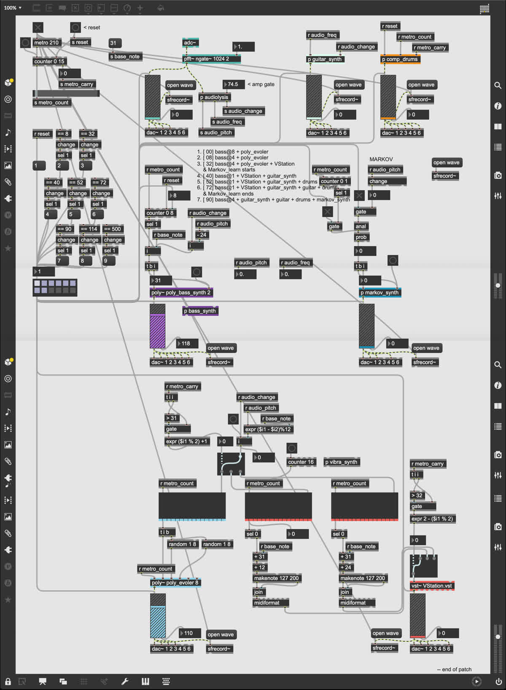
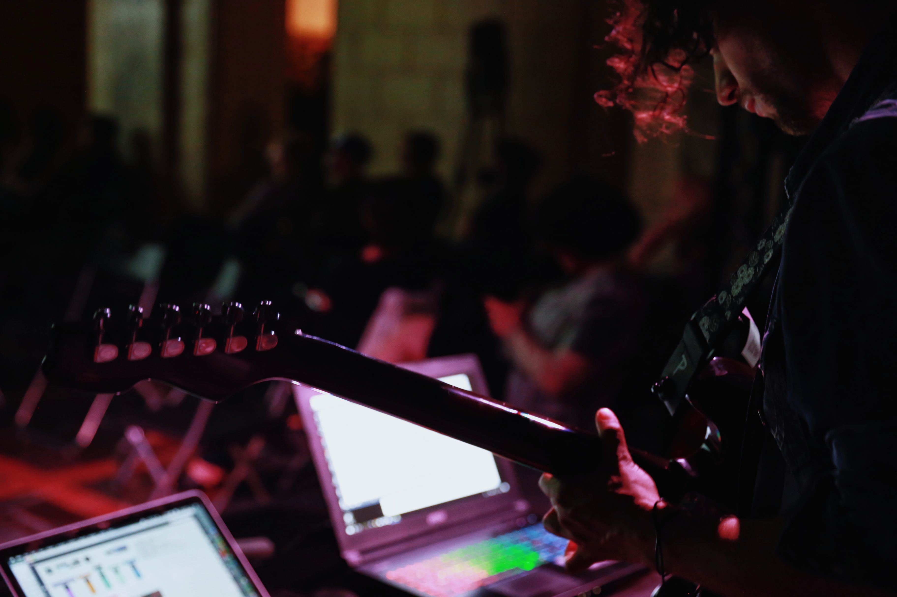
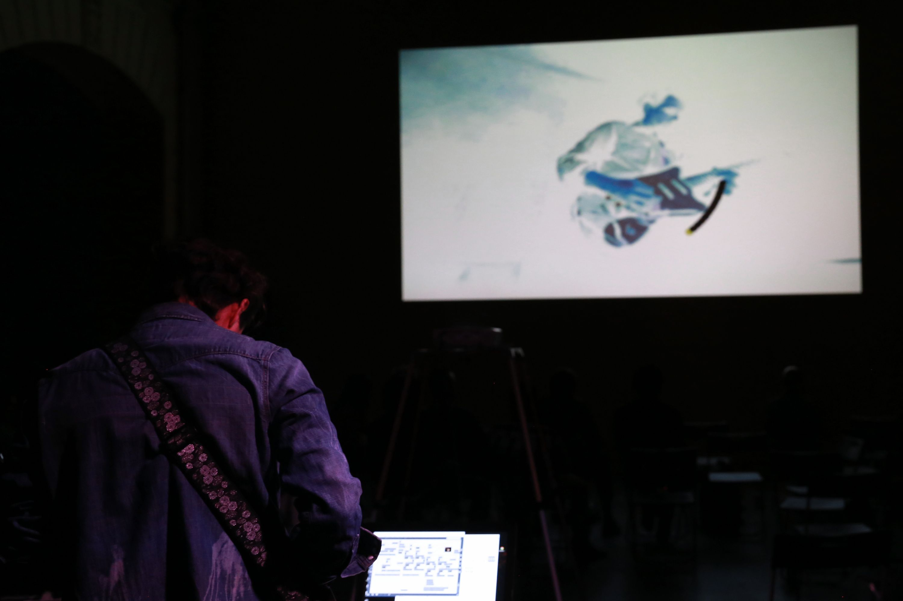

<!--
title: "Competing Voices"
date: "2018-05-13"
display: true
image: "img/portfolio/competing_voices.jpg"
weight: 1
-->

# Competing Voices

An algorithmic musical performance piece about internal conflict and clashing personalities.
<!--more-->

<figure class="vid_container vid_16x9 vid_ext" style="text-align: center">
  <iframe src="https://player.vimeo.com/video/288023728"  frameborder="0" webkitallowfullscreen mozallowfullscreen allowfullscreen></iframe>
</figure>

Competing voices presents an array of 6 personalities which reinterpret what's being played by the performer in their own way. The constant overlapping of voices and sudden cacophonies derived from the same patterns aim to represent a state of constant internal struggle for power, and how we strive to find a balance between them.

The input of the guitar (the performer's conscious voice) is fed to the computer through an interface. Then, it's run through a frequency analysis and given to each voice to interpret using diverse processes such as Markov chains, filters and evolutive patterns. The musical performance is accompanied by a visual presentation that combines geometrical patterns with an altered live feed of my actions.

<figure class="proj_img proj_img_sideR" style="text-align: center">
    
    <figcaption>Competing voices main Max patch</figcaption>
</figure>

  <figure class="proj_img proj_img_full" style="text-align: center">
	
   
  
	<figcaption>Performed at ISSUE Project Room</figcaption>
</figure>

 <a href="#" onClick="history.go(-1);return true;">\< Go Back</a>
