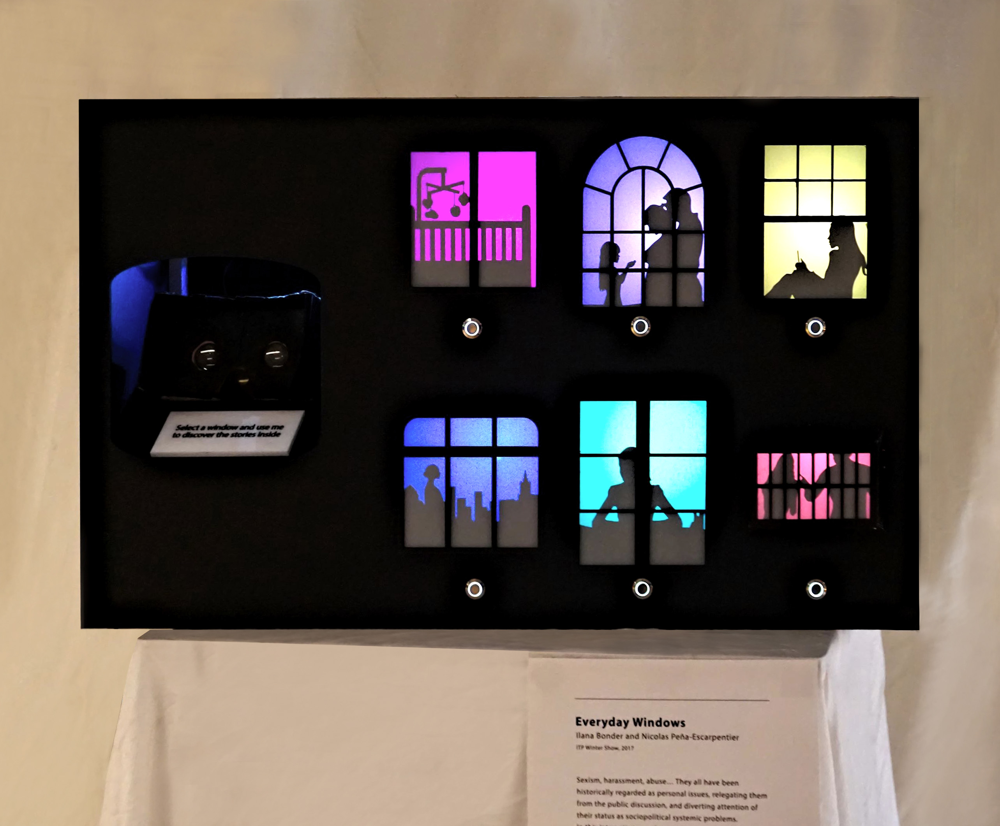

<!--
title: "Everyday Windows"
date: "2017-12-11"
display: true
image: "img/portfolio/evwi_prev.jpg"
weight: 1
-->

# Everyday Windows

<mark>A set of VR experiences foregrounding sociopolitical aspects of everyday sexism.</mark>
<!--more-->
Sexism, harassment, abuse… They all have been historically regarded as personal issues, relegating them from the public discussion, and diverting attention of their status as sociopolitical systemic problems. We want to show the truth of how society as a whole contributes to the expansion of these issues and how it permeates the internal spheres of our lives.

Made in collaboration with [Ilana Bonder](http://bonder.tech).

<figure class="vid_container vid_16x9 vid_ext" style="text-align: center">
  <iframe src="https://player.vimeo.com/video/250218502"  frameborder="0" webkitallowfullscreen mozallowfullscreen allowfullscreen></iframe>
</figure>

## The Windows

In order to portray the intimate circle where these issues are relegated, we took inspiration in Anne Laure Maison's [Tableaux d'Intimités](https://www.annelauremaison.com/tableaux-dintimites/). Creating a physical controller that resembles a dollhouse, we can use cutouts and backlights to convey the idea of prying behind the windows to observe what these women go through on different stages of their lifes (mostly cis-het, middle class).

<figure class="vid_side" style="text-align: center">
    <video class="vid_doc" autoplay loop muted>
        <source src="./media/evwi_inside.mp4" type="video/mp4">
        <!-- <source src="./media/evwi_inside.webm" type="video/webm"> -->
    </video>
</figure>

<figure class="proj_img proj_img_center" style="text-align: center">
    
	<figcaption>Everyday Windows physical controller</figcaption>
</figure>

## Behind the windows

The audience is able to take a look into the selected window with a Google Cardboard headset. There, they are immersed in carefully designed VR scenes, filled with images portraying the different types of sexism inflicted by society. These scenes were created in [three.js](https://threejs.org/) and rendered with the [WebVR API](https://webvr.info/).

	<figure class="vid_container vid_720x2" style="text-align: center">
        <video class="vid_doc" autoplay loop muted width="50%">
            <source src="./media/evwi_vr01.mp4" type="video/mp4">
            <!-- <source src="./media/evwi_vr01.webm" type="video/webm"> -->
        </video>
    </figure>
    <figure class="vid_container vid_720x2" style="text-align: center">
        <video class="vid_doc" autoplay loop muted width="50%">
            <source src="./media/evwi_vr05.mp4" type="video/mp4">
            <!-- <source src="./media/evwi_vr05.webm" type="video/webm"> -->
        </video>
    </figure>

<figcaption>Example VR scenes showing images representing sexism at birth and in the workplace</figcaption>

## The experience

The users are prompted to select a window to immerse themselves in the stories each room tells. Powered by an Arduino MKR1000, the house connects via WebSockets to a Node server to inform the selection of the scene. The phones inside the headsets receive the information, changing the display and giving the audience full control of their experience. By making this part of the project browser-based, the audience can use their own phones without having to install any additional software, making it accessible to a wider public.

 
<figure class="proj_img proj_img_center" style="text-align: center">
    
	<figcaption>Everyday Windows user experience flow -animation by Ilana Bonder</figcaption>
</figure>

 <a href="#" onClick="history.go(-1);return true;">\< Go Back</a>
