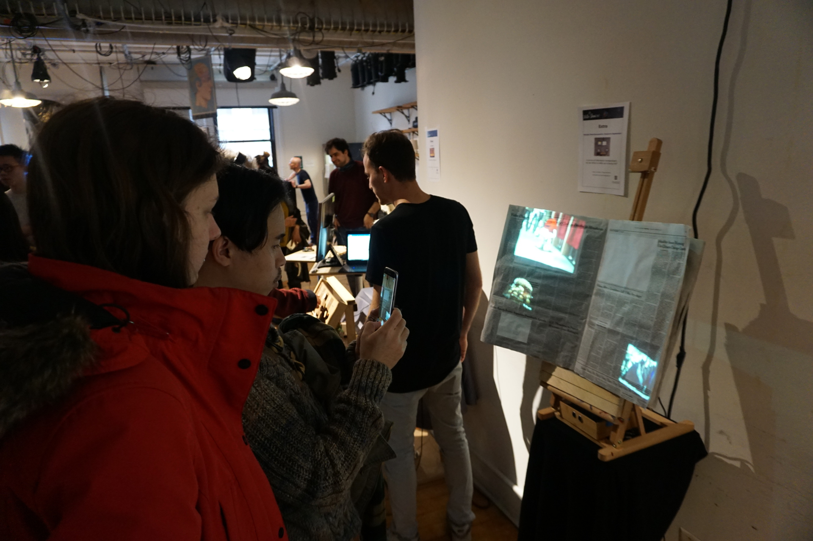
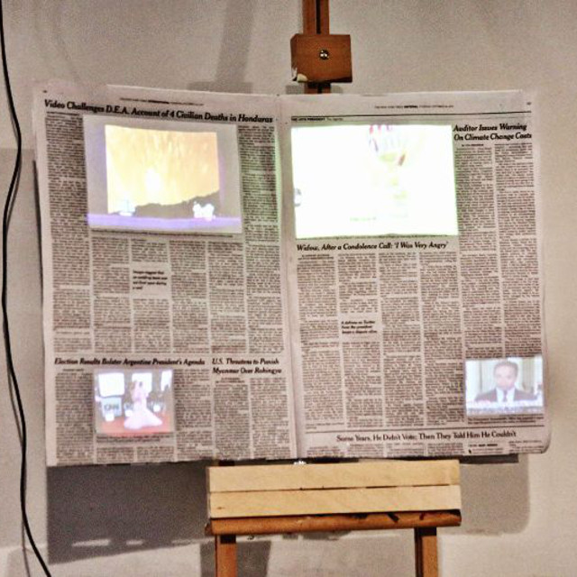
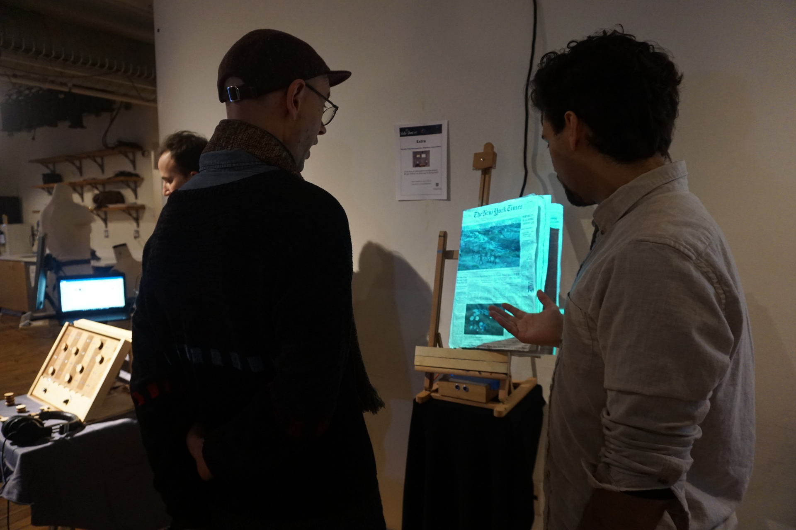
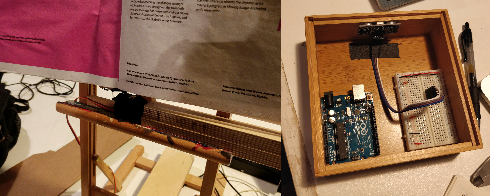

<!--
title: "Extra"
date: "2017-11-01"
display: true
image: "img/portfolio/extra.jpg"
weight: 1
-->

# Extra

Extra is an interactive conceptual exhibition piece. It combines a newspaper with sensors and projection mapping of news media to generate a reflection about media bombardment and the role of information.
<!--more-->
Made in collaboration with [Stephanie Hagemeister](http://www.stephaniehagemeister.com/).

<figure class="vid_container vid_16x9" style="text-align: center">
	<iframe src="https://player.vimeo.com/video/252422777?byline=0" width="640" height="480" frameborder="0" webkitallowfullscreen mozallowfullscreen allowfullscreen></iframe>
</figure>

>  In an era of information bombardment, do we reflect on what we're being told?

Advertisement, the entertainment industry, sports: we're flooded by a constant stream of shallow content. This barrage of stimuli surrounds us in every environment we inhabit, both physical and virtual.

What is all this content we're being fed?

<figure style="text-align: center">
	
	 
	
</figure>

> Marketing is the language of news media, not information.

The idea was born as a reflection on the state of news media. The focus on information was lost in favor of clickbaiting. Views and revenue rate much higher in their scale of importance, rather than public knowledge.

In order to generate this reflection, we overlapped a newspaper -the physical and traditional medium of information- with video projections of different topics, representing the digital contemporary medium-. This is connected to an Arduino controlled servo motor and a proximity sensor.

<figure style="text-align: center">
	
</figure>

As soon as the attention of a member of the audience gets captured and approaches the creation, the sensor triggers the motor, closing the newspaper immediately. At the same time, the projection changes from the media content to white noise, revealing the lack of content of the original media.

<figure style="text-align: center">
	
</figure>

<figure style="text-align: center">
	
	<figcaption>Servo motor and Arduino + sensor setup</figcaption>
</figure>

 <a href="#" onClick="history.go(-1);return true;">\< Go Back</a>
