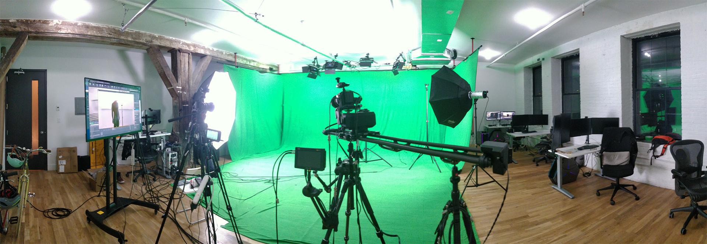
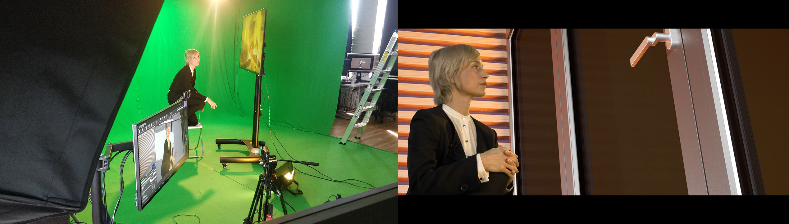
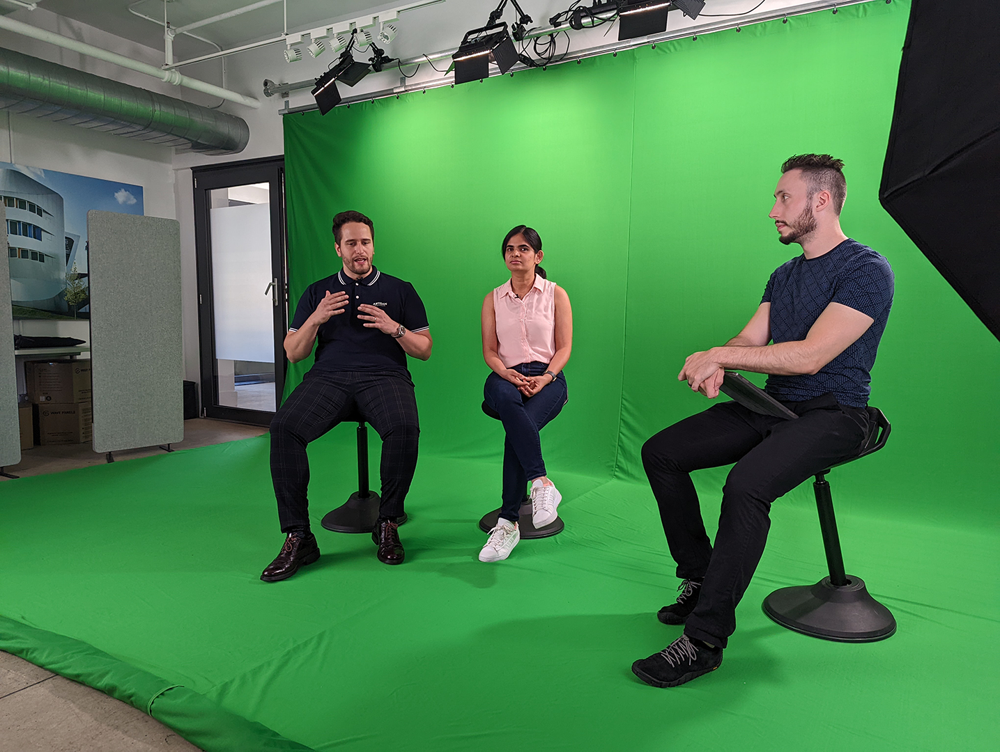
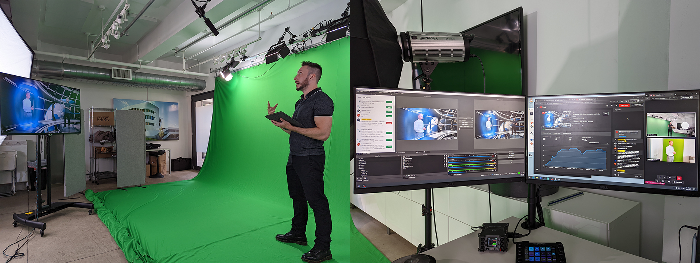

<!-- 
title: "Greenscreen Studio"
date: "2020-12-01"
slug: "greenscreen_studio"
desc: ""
tags: ""
display: true
weight: 1
-->

# Greenscreen Studio

<mark>Spearheaded the creation of a $40k+  virtual-production capable greenscreen studio, from proposal and budget stage, to execution, operation, maintenance, and upgrades.</mark>

<figure class="proj_img proj_img_full" style="text-align: center">
	
    <figcaption>First greenscreen studio iteration</figcaption>
</figure>

This project drastically expanded the Virtual Construction Lab's visualization capabilities, utilizing it for creating high-impact CG-enhanced presentations, intercontinental live-streams, and even educational material.

## Studio Creation 

The creation of the studio was born from a direct need due to the COVID pandemic, as  it became clear it would disrupt the biggest biennial conference in the field, BAU. Anticipating this need, I created a set of proposals targeting diverse aspects of remote experiences, in order to still create a close experience with their clients and be able to share the latest developments from the company. These proposals included several projects, each with preliminary timelines, teams involvement, projected costs, and possible results and synergies.

We developed a 30 second short as a simple prototype MVP that demonstrated the possibilities of the technology, which garnered a very positive reaction and led to the approval to create a $30k studio.

From here, I spent the following couple of months creating a detailed budget for the infrastructure and hardware requirements, overseeing the set-up of the new space, creating a comprehensive timeline for each team involved, and leading the technical development needed to drive the entire studio. In only half a year, I led the process from budget to creating 6 video productions for an online world-wide audience. You can read more about these productions on the [Video Productions](http://nicolaspe.com/portfolio/video_productions/) page.

<figure class="proj_img proj_img_full" style="text-align: center">
	
    <figcaption>Recording on the greenscreen studio</figcaption>
</figure>

After the first round of productions, I kept leading the expansion of the studio: both assessing the necessary upgrade requirements, as well as exploring new possibilities it afforded us. This has also covered the two relocations of the studio, alongside planning and designing the new space, handling the new constraints, scheduling and overseeing services, and set-up and running functionality tests.

<figure class="proj_img proj_img_center" style="text-align: center">
	
	<figcaption>Second iteration of the greenscreen studio</figcaption>
</figure>

## Operation & Establishing Pipelines

Beyond the creation and management of the studio, I was deeply involved in its operation, and project management and execution.

In terms of project management, I was in charge of creating the scope, timeline, milestones and deliverables, retrospectives, and overall production, as well as keeping constant communication with all parties involved. On the execution side, I fulfilled tech development lead, camerography, edition, sound design, and both direction and technical direction roles for our productions. The biggest and most impactful challenge was the creation of mixed pipelines that would adapt to our strengths, workstyles, and desired results.

### Mixed Pipeline
This mixed pipeline was born out of several iterations and was used to produce the first round of enhanced presentations at our studio. The actor to be recorded stands on the greenscreen, and with UE's Virtual Production pipeline, they can see themselves in the virtual environment in real time. This makes them able to react and adapt their acting to specific elements and cues on the environment. Different actions and modifications of the virtual environment get triggered via an iPad that sends OSC signals to Unreal Engine. This way, we can record video from the camera, the virtual actions with Unreal's *Take Recorder*, and the sound from a lavalier microphone, all synchronized with timecode generators.

After all the recordings are done, each recording gets its own treatment: the live recording gets keyed and cleaned up via Nuke; the Unreal recording gets exported in 4K (which would not be possible to do in real time with our equipment); and the audio gets cleaned-up. Finally, all gets put together and edited in Adobe Premiere.

### Live Streams
For the livestreams we had to create a different pipeline that would enable us to deliver the utmost quality for online content. The virtual environments were again created in Unreal Engine, which were sent to the streaming PC via NDI, and received OSC messages to trigger diverse actors. The people would be recorded on the greenscreen stage with a dual-camera setup, and the keying, compositing, and audio adjustments and clean-up were done all in OBS. All the triggers necessary for both OBS and Unreal were fired with a LoupeDeck, making the experience of streaming to YouTube even more seamless.

One special livestream we did involved a remote connection to someone on Schüco Headquarters in Bielefeld, Germany. In order for them to be able to participate, we sent them a package with a webcam, a ring light, and a small greenscreen. After helping them set-up, we used ping.gg for the remote connection, which gave us a connection with such quality and performance, that we were able to key the guest from that feed, and the interview never had any significant delay on the flow of the conversation.

<figure class="proj_img proj_img_full" style="text-align: center">
	
    <figcaption>Remote livestream in progress, showing the different parts that came together</figcaption>
</figure>

<a href="#" onClick="history.go(-1);return true;">\< Go Back</a>
