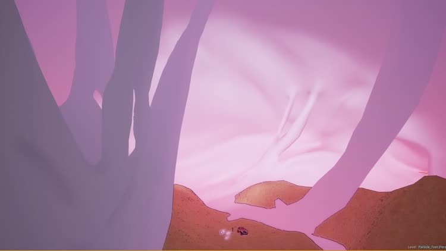

<!--
title: "Heart of a Survivor"
date:  "2019-08-31"
display: true
weight: 1
-->

# Heart of a Survivor

Heart of a Survivor (working title) is the prototype for an unreleased festival-bound virtual reality experience, that takes the audience through a story of loss, love and hope: a journey through the heart of a genocide survivor.

`As this is a yet-unreleased piece, I will not disclose specific details about the piece, instead focusing on the creative and technical journey.`

<figure class="proj_img proj_img_full" style="text-align: center">
	
</figure>

## Adapting screenplay

I worked alongside [Gabriel Brasil](https://www.ejectnow.com/), fellow technologist and art director, to take the script of this heart-wrenching story and transform it to an immersive VR piece. Being a new medium, VR doesn't have an established language as cinema or theatre. As such, it falls into the shoulders of us technologist to work alonside the writers and directors to adapt their scripts, showing them what's possible in this emerging environment and employing the full extent of the opportunities it provides.

<mark class="sideR">The core questions when starting a VR experience: "Why is this in VR? How does it use its capabilities? Who is the user and what can the user do?"</mark>

  <figure class="vid_container vid_16x9" style="text-align: center">
    <iframe src="https://player.vimeo.com/video/358901555"  frameborder="0" webkitallowfullscreen mozallowfullscreen allowfullscreen></iframe>
  </figure>
  <figcaption>Ideation session timelapse - edited by Gabriel Brasil</figcaption>

The script was thoroughly dissected and analyzed from several points of view: story beats and narrative structure, user placement and interaction possiblilities, technical elements and how they play along in VR, scene composition, and more. All these elements were then submitted to the director, presenting her with options and feedback, and starting a collaborative iteration in order to accomplish her view.

 

The memories are recounted inside the metaphorical heart of the main character. The user embodies his presence in the memories, making them a key narrative tool. And as it's not trying to replicate reality, the art direction reflected this from the beginning.

<figure class="proj_img proj_img_sideR" style="text-align: center">
    
</figure>

<figure class="proj_img proj_img_full" style="text-align: center; display: block;">
	
  
  <figcaption>3d heart environment that houses the entire experience</figcaption>
</figure>

## Designing interactions

As an inherently immersive medium, the realm of possibilities of user interactions in VR has to be aligned with the idea of embodiment. As such, they have to be carefully designed. The interactions have to be unobtrussive and transparent, as a mechanic cannot take the user out of the experience.

This can be achieved in two ways. First, we can take advantage of movements that come natural to us, such as grabbing or reaching out to things. Or second, we can incorporate one new action in the beginning of the experience, reinforcing it over the first minutes, so that it becomes natural for the audience and they don't have to actively think to perform it.

<figure class="vid_container vid_720_full" style="text-align: center">
    <video class="vid_doc" controls>
        <source src="./media/demo_interaction.mp4" type="video/mp4">
    </video>
</figure>
<figcaption>Reaching out for a memory object activates the scene</figcaption>

## Animatics

After designing the interactions, laying out the storyboards and with the script in a good state, we needed to prototype the current state to move forward. We recorded ourselves as scratch track and animated the 2d boards, and later a basic VR 3d blocking. Even with stock assets and minimal animations, we were able to get a feel of the pace, interactions and story inside the headset.

<figure class="vid_container vid_720" style="text-align: center">
  <iframe src="https://player.vimeo.com/video/358558909"  frameborder="0" webkitallowfullscreen mozallowfullscreen allowfullscreen></iframe>
</figure>
<figcaption>View of 2d, 3d and volumetric animatics done with Gabriel Brasil</figcaption>

## Exploring pipelines for volumetric technologies

Early on in the process, it became evident that such a powerful and intimate story needed specialized elements to create a deep human connection. To replicate the subtleties of human microgestures, something standard motion capture cannot convey, we looked at volumetric capture technologies.

<!-- VOLUMETRIC CAPTURE TECH & TESTS -->
 

  <figure style="margin: 0" >
    <video class="vid_doc" controls muted />
        <!-- <source src="./media/hs_volumetric.webm" type="video/webm"> -->
        <source src="./media/hs_volumetric.mp4"  type="video/mp4">
    </video>
</figure>
<figcaption style="margin-bottom: 0;">Test of a volumetric asset by 4DSViews with custom shaders materials to achieve a dreamy feel</figcaption>

First, we tested two different products from full 3d volumetric capture studios: [4DSViews' Holosys](https://www.4dviews.com/) and the [Microsoft's Mixed Reality Capture Studio (MRCS)](https://www.microsoft.com/en-us/mixed-reality/capture-studios). Despite achieving decent results in a short time, the degree of manipulation, reliability and costs of these solutions meant that we could not work with them.

<!-- PHOTOGRAMMETRY AND POINT CLOUDS -->

### DepthKit in UnrealEninge

Then, we moved to [DepthKit](https://www.depthkit.tv/), a fantastic 2.5d solution for volumetric capture. As there's no plugin for Unreal Engine, the first step was come up with a proper pipeline. The exported OBJ sequence was imported into Maya [with a special plugin](https://www.highend3d.com/maya/script/obj-i-o-obj-sequences-import-export-for-maya), and re-exported as an *alembic cache*. This proved to be effective, but the textures kept desynchronizing with the geometry cache. To solve it, I used *ffmpeg* to batch downscale the images and used the level sequencer to manipulate their playback.

<!-- Face transplant -->

After getting the technology to work, I experimented with mixed alternatives. As a body's performance can be replicated thanks to motion capture and DepthKit can capture the subtelties of facial performances, I combined both to leverage their strengths and cover their weaknesses: a virtual face transplant.

  <figure style="margin: 0" >
    <video class="vid_doc" autoplay loop muted />
        <!-- <source src="./media/DK_face.webm" type="video/webm"> -->
        <source src="./media/DK_face.mp4"  type="video/mp4">
    </video>
</figure>
  <figcaption>Exploring possibilities: transplanting a volumetric facial performance into a 3d body</figcaption>

## Creating prototypes

## Acknowledgements

I would like to thank to all the amazing people I worked with:

- Victoria Bousis, Director and writer
- [Gabriel Brasil](https://www.ejectnow.com/), co-worker and
- [Todd Bryant](https://toddjbryant.com/) and the [RLab](https://www.rlab.nyc/)
- Matthew Niederhauser and John Fitzgerald, [Sensorium](https://www.sensorium.works/)
- [Chris Hall](https://www.chrissyelie.com/)
- Misha Zabranska

<a href="#" onClick="history.go(-1);return true;">\< Go Back</a>
