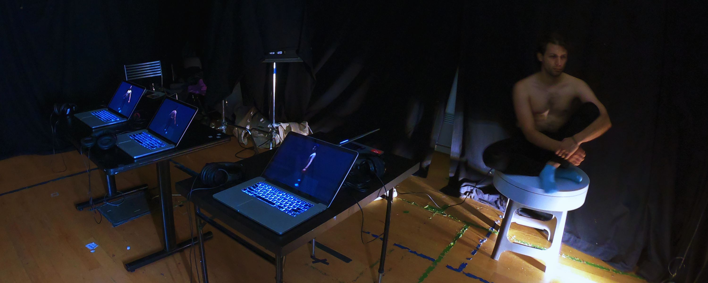
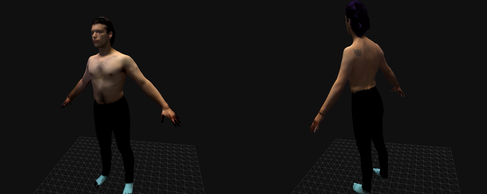
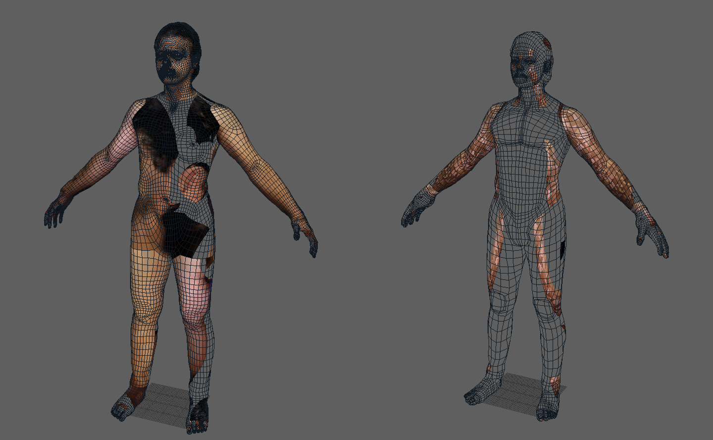

<!--
title: "Me as myself"
date: "2018-10-12"
display: true
image: "img/portfolio/memyself.jpg"
weight: 1
-->

# Me as myself

An exhibition that explores different representations of my persona, trying to uncover who’s the person behind.
<!--more-->

<figure style="text-align: center">
  
</figure>

> How have I built my identity? How can those parts and events be represented? Is there a "real" form that can faithfully portray me?

Our self image in this Internet era is a very curated and carefully constructed work. But having different avatars and representations also questions the authenticity of each one we wield at any moment.

Me as myself is an exhibition that showcases an exploration of different parts of my persona. It offers a reflection on the importance of having a visual representation of your being, while trying to embody my vulnerabilities and the difficulties it brings.

<figure style="text-align: center">
	
  <figcaption>Example of two avatars representing different aspects of myself</figcaption>
</figure>

<!-- <figure class="vid_container vid_16x9" style="text-align: center">
  <iframe src="https://www.youtube.com/embed/GgO3G3XSNBM" frameborder="0" allow="accelerometer; autoplay; encrypted-media; gyroscope; picture-in-picture" allowfullscreen></iframe>
</figure> -->

To create these representations, I took a 3D scan of my physical body and performed varied digital alterations to each one.
These facets are presented to the audience accompanied by a narrated paragraph, offering insight that particular body.

Finally, I also presented my physical body as counterpoint to these creations, but questioning the accuracy of it over the previous ones. Besides the fact that I'm "stuck" in it, is it any more valid than any other creation I could choose to represent myself?

<figure style="text-align: center">
	
  <figcaption>Some failed texture mappings of different models</figcaption>
</figure>

 <a href="#" onClick="history.go(-1);return true;">\< Go Back</a>
