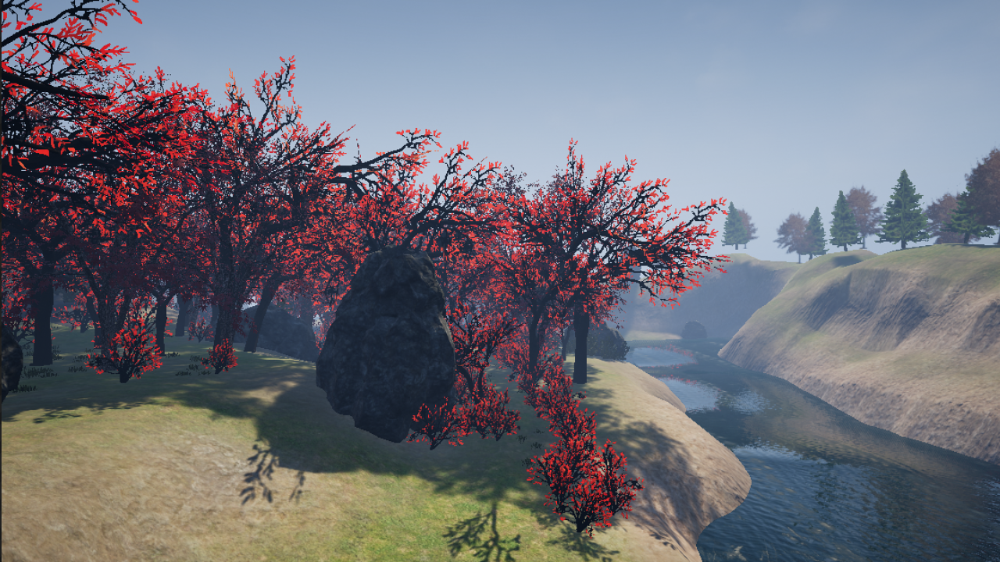
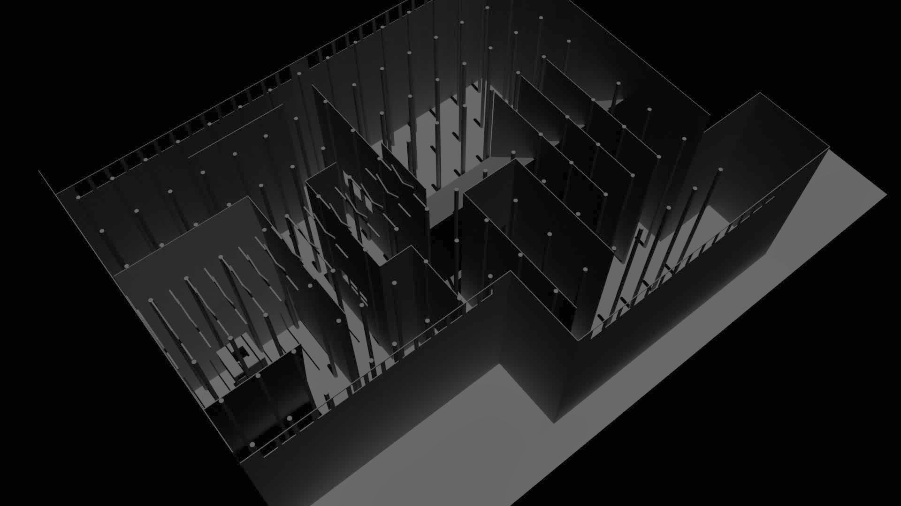

<!--
title: "Peaceful Forest / Dark Halls"
date: "2018-02-28"
display: true
image: "img/portfolio/peacef_logo.png"
weight: 0
-->

# Peaceful Forest / Dark Halls

A set of two VR experimental experiences aimed to explore user's intuitive interactions and their sensorial reactions to diverse and contradicting audiovisual stimuli. <!--more-->

 
<figure class="proj_img proj_img_full" style="text-align: center">
	
	<figcaption>Overview of the Peaceful Forest</figcaption>
</figure>

## Dark Halls

Dark Halls is a maze-like factory VR environment. Users can navigate through the space on a levitating platform by interacting with different parts of the environment. While trying to find the exit, they might uncover mysteries in an otherwise unthreatening space.

	<figure class="vid_container vid_720x2" style="text-align: center;" width="50%">
		<video src="./media/peaceDark_clip01.webm" class="vid_doc" autoplay loop />
	</figure>
	<figure class="vid_container vid_720x2" style="text-align: center;" width="50%">
		<video src="./media/peaceDark_clip03.webm" class="vid_doc" autoplay loop />
	</figure>

<figure class="proj_img proj_img_full" style="text-align: center">
	
	<figcaption>3D Model of Dark Halls' factory, done in Maya</figcaption>
</figure>

## Peaceful Forest

When exiting the factory space, users arrive at the Peaceful Forst, a meditative VR experience designed to induce a state of mindfulness. It consists on a relaxing space where it's users can find refuge from any stressing environment. But looks can be deceiving, and threats lie even in beautiful places, creating an interesting dissonance for users to explore.

<figure class="proj_img proj_img_center" style="text-align: center">
	
	<figcaption>Forest's waterside</figcaption>
</figure>

	<figure class="vid_container vid_720x2" style="text-align: center;" width="50%">
		<video src="./media/peaceDark_clip05.webm" class="vid_doc" autoplay loop/>
	</figure>
	<figure class="vid_container vid_720x2" style="text-align: center;" width="50%">
		<video src="./media/peaceDark_clip04.webm" class="vid_doc" autoplay loop/>
	</figure>

<figure class="proj_img proj_img_full" style="text-align: center">
	
	<figcaption>Zoomed out view of the level composition</figcaption>
</figure>

Designed in Unreal Engine 4 for the HTC Vive.

 

<a href="#" onClick="history.go(-1);return true;">\< Go Back</a>
