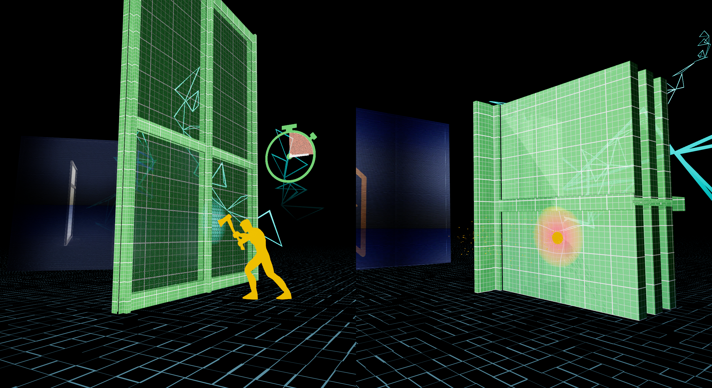

<!-- 
title: "Sälzer VR"
date: "2023-04-17"
slug: "saelzer_vr"
desc: ""
tags: ""
display: true
weight: 1
-->

# Sälzer VR 

<mark>A short marketing-focused VR film for the building-security firm, [Sälzer](https://www.saelzer-security.com/en), shown in BAU 2023: the "world's leading architecture, materials and systems trade-fair".</mark>

<figure class="proj_img proj_img_center" style="text-align: center; display: block;">
	 
    <figcaption>Virtual office building using a Sälzer system used for the security demonstrations</figcaption>
</figure>

## Creation of the VR Experience

For the creation of this VR piece I managed the full team of CG artists and developers in order to meet the deadline in only 10 weeks, as well as created storyboards, scripts, and space design, iterating over them in a collaborative fashion. 

This process started when Sälzer contacted us to create a VR piece for the upcoming BAU, looking for an impactful short that could showcase their capabilities. From their marketing talking points, I created a storyboard that not only took these point in, but also took special consideration of the medium, the possibilities it affords, and the setting of the exhibition; resulting in an experience that leverages the full capabilities of VR as a virtual and storytelling medium. This storyboard focused on showcasing crucial aspects of Sälzer's business: explosion, bullet, and burglar protection, presented in such a way that would be impossible to show in an exhibition. We needed the audience to be able to feel the full impact and threat of these case scenarios, for them to value the protection offered by the company's products; and the immersive qualities of Virtual Reality create the perfect setting to deliver the dramatic impact of them.

<figure class="proj_img proj_img_center" style="text-align: center; display: block;">
	 
    <figcaption>High-security features: burglar resistance (left) and bullet resistant (right)</figcaption>
</figure>

As an integral part of this project, I maintained a close relation with the client, creating numerous avenues for collaboration and open communications. In order to do this, we had several feedback rounds on storyboard, script, and overall development. I took special consideration on explaining the unique possibilities and challenges brought by VR as a medium, one they had not used before. As the project was nearing completion, I would send both packaged project builds as well as video recordings of the full experience, so that the clients involved that did not have access to a headset could also leave timely feedback. This proved an effective way to keep a positive collaborative and iterative process that granted us the ability to deliver the best possible result.

<figure class="vid_container vid_16x9 vid_ext" style="text-align: center">
  <iframe src="https://player.vimeo.com/video/846728337" frameborder="0" webkitallowfullscreen mozallowfullscreen allowfullscreen></iframe>
</figure>            

## Conference

For the exhibition of the piece at BAU 2023, I was in charge of its on-site setup, maintenance, and operation. 

  <figure class="proj_img proj_img_full" style="text-align: center">
    
    <figcaption>The VR short being experienced by the audience of BAU 2023 in the Schüco booth</figcaption>
</figure>

The setup work started months before the launch date, as it involved close coordination with the site-managers and technical crew in order to fulfill all the requirements. This included a UV-C disinfection cabinet, in order to have a minimum sanitary standard, alongside a section on the exhibition space for it as well as charging and storage. Furthermore, I requested a private wireless network with static IPs for the headsets, and computer and iPad with the controlling app to communicate. 

On the days right before the exhibition, I traveled to München to set-up all the equipment on-site. This consisted of initializing, calibrating and loading the experience into 18 headsets, as well as performing stress tests of all the equipment to make sure everything was working properly. I was also in charge of training the VR docents on the complete onboarding, offboarding and initializing procedures, as well as simple troubleshooting. 

The Sälzer VR experience at BAU was an absolute success, with more than 450 views and an extremely positive reception. The success of this piece also garnered a lot of praise from the internal team at Sälzer, leading to this short to also be used at their headquarters in Marburg, Germany, to introduce their clients to their projects and expertise.

<a href="#" onClick="history.go(-1);return true;">\< Go Back</a>
