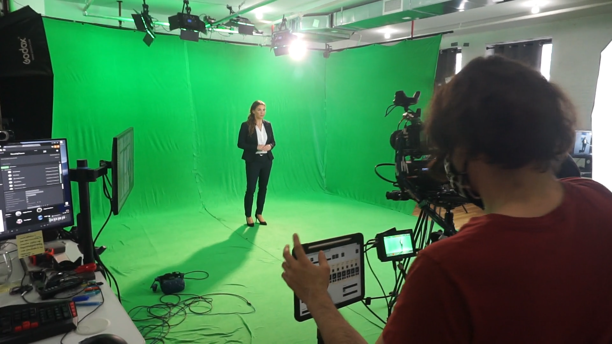
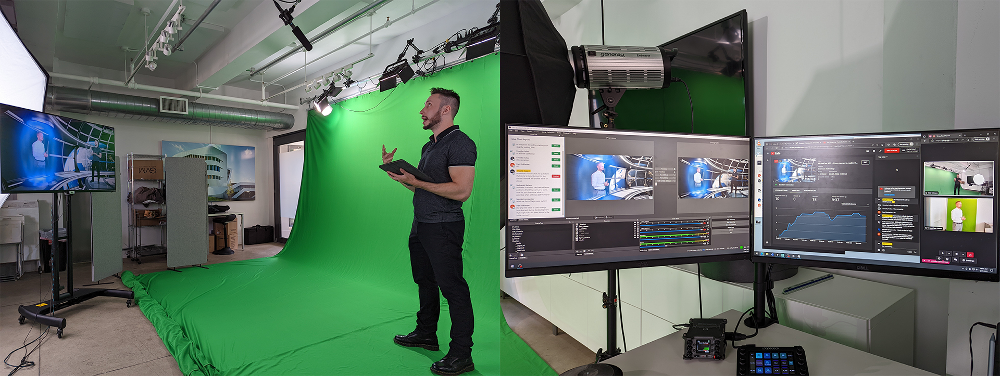

<!-- 
title: "Video Productions"
date: "2021-01-01"
slug: "video_productions"
desc: ""
tags: ""
display: true
weight: 1
-->

# Video Productions

<mark>During my time at the Virtual Construction Lab of Schüco, I led several video productions for various clients, utilizing diverse technologies, and fulfilling a wide array of roles.</mark>

## Innovation Now
<mark>Set of enhanced presentations for online marketing events at the beginning of the COVID pandemic.</mark>

These presentations were the first production created on the [greenscreen studio](http://nicolaspe.com/portfolio/greenscreen_studio/), consisting of three 30 second teasers and three 4 minute presentations. In order to create the most innovative and attention-grabbing presentations for physical products that used to be shown in person, we developed a unique style merging a real-life presenter that would interact closely with virtual environments and assets. These presentations were to be used for key segments of the larger "Innovation Now" presentations, an event meant to replace the cancelled conference BAU 2021. With three overarching topics (Health, Intelligent, and Security), these shorts broke new grounds for Schüco's in-house productions.

<figure class="proj_img proj_img_center" style="text-align: center">
	
	<figcaption>Creation of the Innovation Now shorts</figcaption>
</figure>

For this project I was the technical lead and director, in charge of not only providing the technical infrastructure and development for it, but also producing timelines, splitting management tasks, and maintaining and operating the studio. Additional tasks on the creative side consisted on providing extensive feedback and edits on the storyboards and scripts, setting up and triggering the virtual sequences, co-editing the presentations, crafting the sound design and mixes, and directing the actresses for each presentation.

<figure class="vid_container vid_16x9 vid_ext" style="text-align: center">
  <iframe src="https://player.vimeo.com/video/846742320" frameborder="0" webkitallowfullscreen mozallowfullscreen allowfullscreen></iframe>
</figure>

## Live Streams
<mark>Series of internal Livestreans, focused on internal knowledge sharing for a worldwide Schüco audience.</mark>

Fulfilling a need to better share information internally within the company, [we used our newly-created studio](http://nicolaspe.com/portfolio/greenscreen_studio/) to stream a series of interviews with guests all over the world. This provided a unique opportunity for several teams inside our Digital division to share their specific breakthroughs, as well their particular innovations and challenges. These streams also had a Q&A section to take questions from the live audience and gather a wide array of opinions and take a deeper dive where interest lies.

In this initiative I was in charge of the coordination and management, script revision, technical development and lead, camerography, and live triggers. Our presentations accumulated almost 1000 views and reached a peak of 70 live-viewers.

<figure class="proj_img proj_img_center" style="text-align: center">
	
	<figcaption>Remote livestream in progress, showing the different parts that came together</figcaption>
</figure>

## Internet of Façades
<mark>Production of marketing shorts for an innovative digital product.</mark>

The team in charge of the [Internet of Façades](https://www.schueco.com/sy/iofid) project came to us to produce an innovative short for the launch of their product. Thanks to our closer affinity to digital products and ground-breaking work for the Innovation Now presentations, we were their primary choice for this endeavor. Thanks to our understanding of the technologies involved, their full potential, and our new capabilities, we were able to assemble an audiovisual production unique in our company. Additionally, I proposed the creation of social media cuts derived from diverse user storyline segments and taking advantage of the already shot material, leading to the creation of 4 extra shorts.

I took the roles of co-director, tech lead and coordinator, co-editor, and sound designer, as well as taking care of certain management tasks. This project was a huge success, being prominently featured on the launch page of the product and reutilizing our material in future presentations. 

<figure class="vid_container vid_16x9 vid_ext" style="text-align: center">
    <iframe src="https://www.youtube.com/embed/7v4Ge2dNiv8" title="Internet of Façades - YouTube video player" frameborder="0" allow="accelerometer; clipboard-write; encrypted-media; gyroscope" allowfullscreen></iframe>
</figure>

<a href="#" onClick="history.go(-1);return true;">\< Go Back</a>
